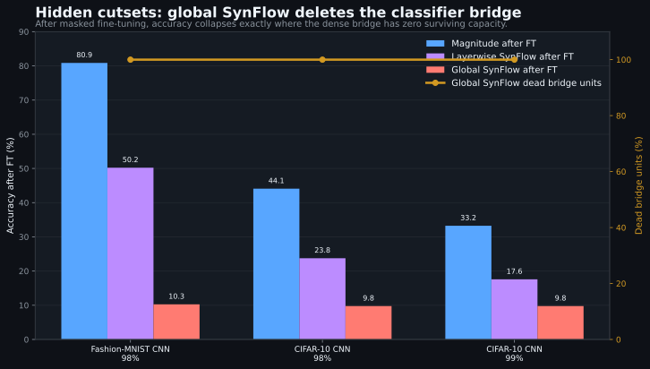

# Neuro-AI Lab

A research lab testing neuroscience-inspired claims about artificial networks, run with strict evidence discipline: every headline number is backed by a checked-in JSON artifact and verified by an audit script.

> **Start here: current state, frozen/open boundaries, and canonical execution paths are maintained only in [`STATUS.md`](STATUS.md). Read it before using this repository.**

## Research lines

| Line | Thesis | State |
|---|---|---|
| 04 Circuit-viability pruning | Useful sparse networks are viable circuits, not collections of important synapses. Severe pruning fails when it destroys circuit viability. | FROZEN / AUDITED (claim audit `234/234`) |
| 06 UESD — fixed-point arc | Generation as continuous embedding-space dynamics with no softmax in the loop, driven by a self-consistency energy. | CONVERGENCE ARC CLOSED NEGATIVE (D40); surviving core is the D22 variable-T mechanism |
| 06 UESD — semantic ratchet | Outcome-trained best-state memory for a transient solver, gated against compute-matched sampling plus learned reranking. | PREREGISTERED / NOT YET RUN; zero empirical results |
| 01/02/03/05 pilots | Grokking prediction, sleep-cycle training, reconsolidation, DDM-as-depth. | FROZEN HISTORICAL (single-run pilots) |

## Headline finding (04)

At 98-99% global sparsity, global SynFlow can assign **zero** surviving weights to `fc1`, the first dense classifier bridge in CNNs. Once that bridge is gone, masked fine-tuning cannot recover the model (3/3 cases; mean after-fine-tuning delta vs magnitude: **-42.80 points**). The constructive counterpart, path-capacity pruning, rescues the collapse under the same parameter budget and beats magnitude in several severe-sparsity regimes.



Full evidence, mechanism hierarchy, selector evolution, and the consolidated results table: `docs/CIRCUIT_VIABILITY_PRUNING_REPORT.md`.

## Key negative finding (06)

The tested self-consistency energy `E(s)=||F_theta(s,c)||^2` does not produce correct decoded fixed points: when the dynamics finally converge (D40, strong SC), ~100% of converged examples are wrong attractors. The system is a finite-time transient solver. The defensible surviving result is D22 variable-T training (contraction-rate suppression, invariant across depth/task/architecture). Synthesis: `docs/UNIFIED_ERROR_SPACE.md`.

## Repository map

| Path | Purpose |
|---|---|
| `STATUS.md` | **Canonical current state. Read first.** |
| `docs/CIRCUIT_VIABILITY_PRUNING_REPORT.md` | Canonical 04 synthesis (incl. neuroscience framing, route-deficit predictor, consolidated results table). |
| `docs/CLAIM_EVIDENCE_LEDGER.md` / `docs/CLAIM_AUDIT.md` | 04 claim scope and generated audit. |
| `docs/UNIFIED_ERROR_SPACE.md` | Canonical UESD synthesis with current verdict. |
| `experiments/EXPERIMENTS.md` | Chronological lab notebook (reverse-chronological, all lines). |
| `experiments/ledger.jsonl` | Machine-readable run ledger. |
| `experiments/04_criticality_pruning/` | 04 experiment runners, writeups, synthesis + audit scripts. |
| `experiments/06_uesd/` | UESD experiments, proofs, review corpus, `audit_uesd_claims.py`. |
| `shared/` | Reusable pruning diagnostics, capacity masks, selectors, pilot metrics. |
| `results/` | JSON evidence artifacts for lines 01-05 and 04. |
| `figures/04_circuit_viability/` | Generated figures (from checked-in artifacts). |

## Installation

```powershell
python -m venv .venv
.\.venv\Scripts\Activate.ps1
pip install -r requirements.txt
```

PyTorch + torchvision; GPU optional for synthesis/audits, recommended for rerunning training.

## Validation

These read checked-in artifacts only and complete in seconds:

```powershell
python experiments\04_criticality_pruning\synthesize_synflow_pathology.py
python experiments\04_criticality_pruning\audit_synflow_pathology.py
python experiments\04_criticality_pruning\synthesize_path_capacity.py
python experiments\04_criticality_pruning\audit_circuit_viability_claims.py
python experiments\06_uesd\audit_uesd_claims.py
```

Full training scripts are provenance and are not part of the default workflow; see the agent landing contract in `STATUS.md`.
