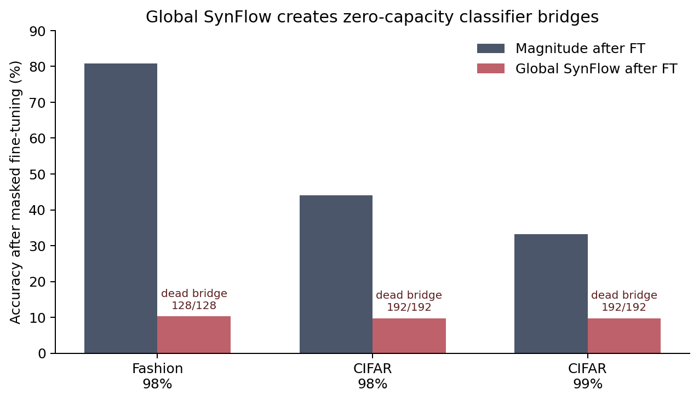
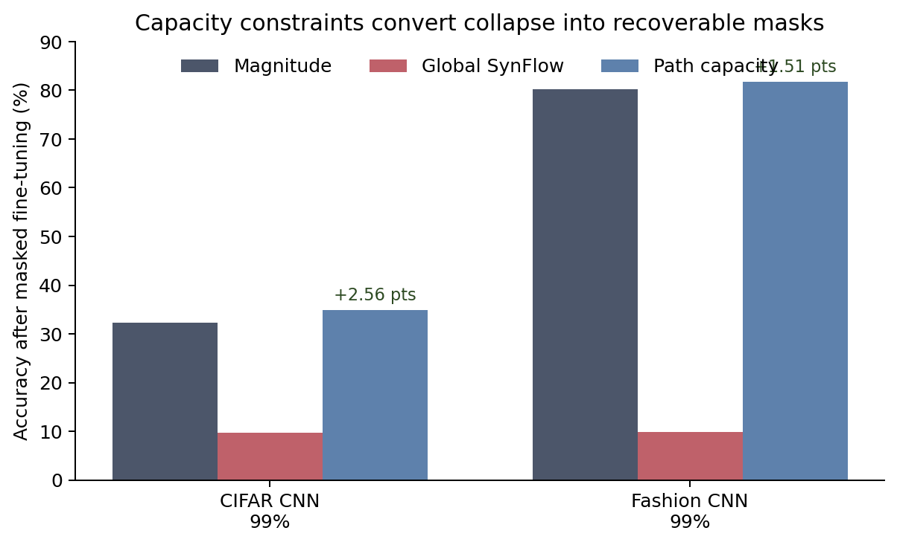
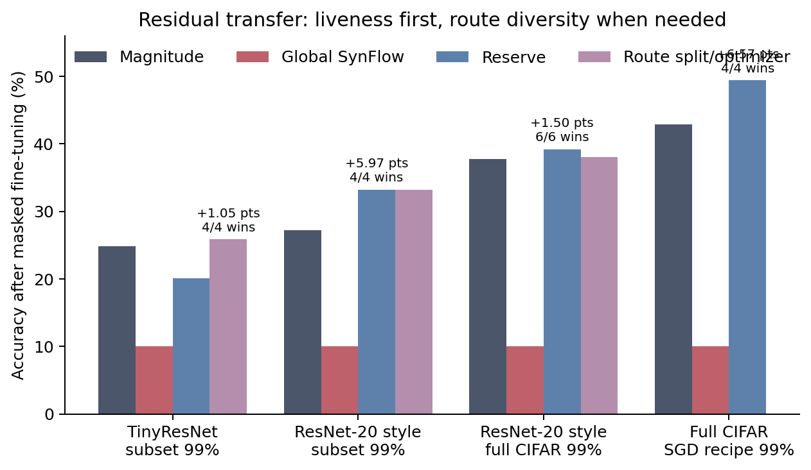
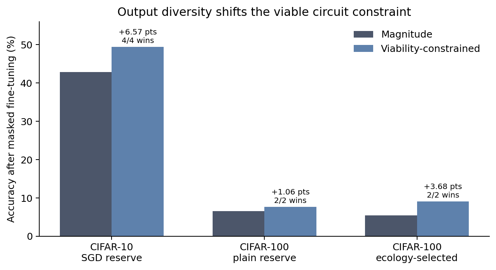
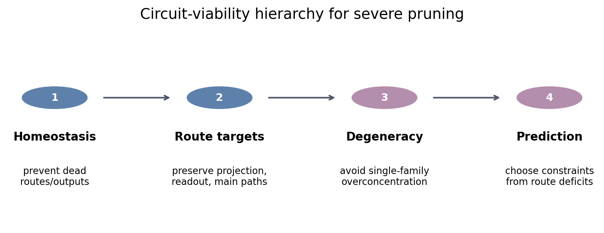

# From Synaptic Saliency to Circuit Viability

## One-line thesis

Pruning should preserve circuits, not just synapses.

## Abstract

Severe neural network pruning is usually framed as a problem of ranking individual weights. This repo shows that view is incomplete. At extreme sparsity, global saliency methods can preserve many high-scoring weights while creating hidden topological cutsets that destroy communication through the model. The clearest failure is global SynFlow deleting every weight in dense classifier bridges, causing chance-level recovery after masked fine-tuning.

The constructive result is Path-Capacity Pruning: preserve minimum viable communication capacity across vulnerable route families, then spend the remaining parameter budget by saliency. Across CNN and residual experiments, capacity constraints rescue SynFlow collapse, beat magnitude in several severe-sparsity settings, and reveal a hierarchy of circuit constraints: first preserve liveness/homeostasis, then optimize route-family balance and degeneracy.

## Core claim

A sparse mask is not just a set of surviving weights. It is a circuit.

Severe pruning fails when the selected weights no longer form a viable communication graph. A pruning method should therefore optimize synaptic efficiency subject to circuit viability constraints:

- no required route family collapses;
- representation can still reach readout;
- residual/projection/main paths remain balanced enough for recovery;
- capacity is not overconcentrated into a single route family.

## Neuroscience mapping

| Neuroscience principle | Pruning analogue | Repo evidence |
|---|---|---|
| Synaptic pruning | Remove weak/redundant weights. | Magnitude, SynFlow, and saliency baselines. |
| Homeostatic plasticity | Prevent regions/routes from becoming silent. | Capacity reserve eliminates dead bridge/output collapse. |
| Use-dependent stabilization | Prefer routes that carry useful signal. | Naive activation-supported reserve was tested and failed, narrowing the mechanism. |
| Degeneracy | Preserve multiple route families, not one brittle path. | Diversity-penalized route optimizer beats magnitude in TinyResNet `99%`. |
| Communication backbones | Preserve bottleneck connectivity. | Projection/readout splits improve residual severe pruning. |

The important distinction is that biology does not merely delete isolated synapses. It remodels circuits while preserving functional viability.

## Discovery: SynFlow creates hidden cutsets

Global SynFlow can allocate zero surviving weights to dense classifier bridges.

| Case | Magnitude after FT | Global SynFlow after FT | SynFlow bridge keep | Dead bridge units |
|---|---:|---:|---:|---:|
| Fashion-MNIST CNN, `98%` | `80.86%` | `10.28%` | `0.0000` | `128/128` |
| CIFAR-10 CNN, `98%` | `44.08%` | `9.76%` | `0.0000` | `192/192` |
| CIFAR-10 CNN, `99%` | `33.24%` | `9.76%` | `0.0000` | `192/192` |

Primary artifacts:

- `experiments/04_criticality_pruning/SYNFLOW_PATHOLOGY_SYNTHESIS.md`
- `results/04_criticality_pruning/synflow_pathology_synthesis.json`

Interpretation:

Global saliency can preserve high-scoring weights while deleting a required communication bridge. Fine-tuning cannot recover because the mask has removed the route.

## Constructive result: Path-Capacity Pruning

Path-Capacity Pruning adds circuit constraints around saliency:

1. Compute base saliency scores.
2. Identify vulnerable route families or cutsets.
3. Reserve capacity so critical routes remain viable.
4. Fill remaining budget by saliency.
5. Fine-tune under the fixed mask.

Current reusable utilities:

- `shared/path_capacity_pruning.py`
- `shared/residual_route_capacity.py`

## CNN results

### CIFAR-10 CNN reserve sweep

At CIFAR-10 CNN `99%`, capacity reserve beats magnitude across a broad reserve band.

Best result:

| Method | After FT | Delta vs magnitude | Wins |
|---|---:|---:|---:|
| magnitude | `32.31%` | baseline | baseline |
| global SynFlow | `9.76%` | `-22.56` pts | `0/4` |
| reserve `0.60` | `34.88%` | `+2.56` pts | `4/4` |

Primary artifact:

- `experiments/04_criticality_pruning/CIFAR10_CNN_CAPACITY_RESERVE_SWEEP_99PCT.md`

### Fashion-MNIST transfer

Capacity reserve transfers to Fashion-MNIST CNN.

| Sparsity | Magnitude | Global SynFlow | Reserve `0.60` | Delta vs magnitude |
|---:|---:|---:|---:|---:|
| `98%` | `84.79%` | `9.92%` | `85.14%` | `+0.36` pts |
| `99%` | `80.24%` | `9.89%` | `81.75%` | `+1.51` pts |

Primary artifact:

- `experiments/04_criticality_pruning/FASHION_MNIST_CNN_CAPACITY_TRANSFER.md`

## Residual results

Residual networks expose the next layer of mechanism. Output liveness is necessary, but not always sufficient.

### TinyResNet route-quality audit

At TinyResNet `99%`, total dead outputs becomes a weaker predictor once masks are technically alive. Projection-route capacity becomes more informative.

| Scope | Route min correlation | Projection min correlation | Dead outputs correlation |
|---|---:|---:|---:|
| TinyResNet `98%` | `+0.852` | `+0.830` | `-0.927` |
| TinyResNet `99%` | `+0.215` | `+0.842` | `-0.370` |

Primary artifact:

- `experiments/04_criticality_pruning/CIFAR10_TINY_RESNET_ROUTE_QUALITY_AUDIT.md`

### Projection/readout split

A targeted split across main/projection/readout families beats magnitude in TinyResNet `99%`.

| Method | After FT | Delta vs magnitude | Wins |
|---|---:|---:|---:|
| magnitude | `24.89%` | baseline | baseline |
| plain reserve `0.60` | `20.53%` | `-4.36` pts | `0/4` |
| projection/readout `40/35/25` | `25.63%` | `+0.74` pts | `3/4` |

Primary artifact:

- `experiments/04_criticality_pruning/CIFAR10_TINY_RESNET_ROUTE_SPLIT_SWEEP_99PCT.md`

### Predicted route split

A route-deficit predictor selected a similar split before fine-tuning.

| Method | After FT | Delta vs magnitude | Wins |
|---|---:|---:|---:|
| magnitude | `25.04%` | baseline | baseline |
| plain reserve `0.60` | `20.21%` | `-4.83` pts | `0/4` |
| predicted deficit split | `25.12%` | `+0.08` pts | `2/4` |

Primary artifact:

- `experiments/04_criticality_pruning/CIFAR10_TINY_RESNET_PREDICTED_ROUTE_SPLIT_99PCT.md`

Interpretation:

The effect is tiny, but it moves from post-hoc split selection toward pre-finetuning route-deficit prediction.

### Diversity optimizer

Target matching alone overprotected projection routes and failed. Adding a degeneracy-style penalty against route-family overconcentration produced the strongest optimizer-style TinyResNet result.

| Method | After FT | Delta vs magnitude | Wins |
|---|---:|---:|---:|
| magnitude | `24.80%` | baseline | baseline |
| plain reserve `0.60` | `20.13%` | `-4.67` pts | `0/4` |
| tuned `40/35/25` | `26.04%` | `+1.25` pts | `3/4` |
| diversity optimizer | `25.85%` | `+1.05` pts | `4/4` |

Primary artifact:

- `experiments/04_criticality_pruning/CIFAR10_TINY_RESNET_DIVERSITY_ROUTE_OPTIMIZER_99PCT.md`

Interpretation:

Degeneracy becomes operational: do not let the optimizer preserve one route family by starving the rest.

### DeepTinyResNet transfer

A deeper residual model with two blocks per stage shows positive transfer, but the dominant mechanism changes.

Four-seed replicate:

| Method | After FT | Delta vs magnitude | Wins |
|---|---:|---:|---:|
| magnitude | `28.48%` | baseline | baseline |
| global SynFlow | `9.98%` | `-18.50` pts | `0/4` |
| plain reserve `0.60` | `30.20%` | `+1.72` pts | `3/4` |
| tuned `40/35/25` | `29.88%` | `+1.41` pts | `3/4` |
| diversity optimizer | `28.83%` | `+0.35` pts | `1/4` |

Primary artifact:

- `experiments/04_criticality_pruning/CIFAR10_DEEP_TINY_RESNET_DIVERSITY_ROUTE_OPTIMIZER_99PCT_REPLICATE.md`

Interpretation:

In deeper residuals, broad liveness/homeostasis dominates. Magnitude leaves hundreds of dead outputs; capacity reserve fixes that and beats magnitude. Fine route-family diversity matters after liveness is no longer the limiting factor.

### ResNet-20-style transfer

A CIFAR ResNet-20-style model provides the first standard residual benchmark check.

| Method | After FT | Delta vs magnitude | Wins |
|---|---:|---:|---:|
| magnitude | `27.25%` | baseline | baseline |
| global SynFlow | `10.03%` | `-17.22` pts | `0/4` |
| plain reserve `0.60` | `33.22%` | `+5.97` pts | `4/4` |
| tuned `40/35/25` | `30.60%` | `+3.36` pts | `4/4` |

Primary artifact:

- `experiments/04_criticality_pruning/CIFAR10_RESNET20_CAPACITY_99PCT.md`
- `experiments/04_criticality_pruning/CIFAR10_RESNET20_CAPACITY_99PCT_REPLICATE.md`

Interpretation:

The result transfers to a ResNet-20-style architecture. Again, the key mechanism is homeostasis: magnitude leaves hundreds of dead outputs, while reserve capacity eliminates dead outputs and improves recovery.

### Full CIFAR-10 ResNet-20-style transfer

The same ResNet-20-style experiment was run on full CIFAR-10 train/test and aggregated across six independent seeds.

| Method | After FT | Delta vs magnitude | Wins |
|---|---:|---:|---:|
| magnitude | `37.72%` | baseline | baseline |
| global SynFlow | `10.00%` | `-27.72` pts | `0/6` |
| plain reserve `0.60` | `39.21%` | `+1.50` pts | `6/6` |
| tuned `40/35/25` | `38.06%` | `+0.34` pts | `3/6` |

Primary artifact:

- `experiments/04_criticality_pruning/CIFAR10_FULL_RESNET20_CAPACITY_99PCT_SIXSEED.md`

Interpretation:

The full-CIFAR result is positive but smaller than the subset result. Capacity reserve still eliminates dead outputs and beats magnitude on all six seeds, while SynFlow remains near chance. The tuned route split is positive on average but less robust, so the strongest current full-dataset claim is broad homeostatic circuit viability rather than hand-tuned route allocation.

### Stronger full-CIFAR SGD/cosine recipe

The full-CIFAR result was then stress-tested with a stronger dense training recipe: 20 SGD/cosine dense epochs followed by 5 masked fine-tune epochs.

| Method | After FT | Delta vs magnitude | Wins | Dead outputs |
|---|---:|---:|---:|---:|
| magnitude | `42.87%` | baseline | baseline | `343.0` |
| global SynFlow | `10.00%` | `-32.87` pts | `0/4` | `647.2` |
| plain reserve `0.60` | `49.43%` | `+6.57` pts | `4/4` | `1.8` |

Primary artifact:

- `experiments/04_criticality_pruning/CIFAR10_FULL_RESNET20_CAPACITY_99PCT_SGD_RECIPE_FOURSEED.md`

Interpretation:

This is the current strongest result. The capacity reserve advantage grows under the stronger recipe rather than disappearing. Mechanistically, magnitude has zero measured main-path floor and hundreds of dead outputs, while reserve restores a main-path capacity floor and nearly eliminates output death. This strengthens the neuroscience framing: the useful intervention is homeostatic circuit viability under extreme sparsity, not a marginal scoring heuristic.

### CIFAR-10 predicted route split transfer

The conservative route-deficit predictor was then applied back to full CIFAR-10 under the same strong SGD/cosine recipe.

| Method | After FT | Delta vs magnitude | Wins | Main min | Projection min | FC score | Dead outputs |
|---|---:|---:|---:|---:|---:|---:|---:|
| magnitude | `42.09%` | baseline | baseline | `0.0000` | `1.3671` | `3.7406` | `352.0` |
| plain reserve | `47.88%` | `+5.78` pts | `2/2` | `1.2302` | `1.1929` | `3.3268` | `1.0` |
| predicted route split | `46.92%` | `+4.82` pts | `2/2` | `1.0115` | `1.5676` | `3.6403` | `0.0` |

Primary artifact:

- `experiments/04_criticality_pruning/CIFAR10_FULL_RESNET20_PREDICTED_ROUTE_SPLIT_99PCT_SGD_RECIPE.md`

Interpretation:

The selector adapts qualitatively: on CIFAR-10 it chooses main/projection-heavy splits rather than the CIFAR-100 readout-heavy split. But it still trails plain reserve, so the current predictor is not a universal optimizer. The evidence supports a more specific claim: route-deficit prediction can adapt the direction of the constraint, while task-specific recovery still determines whether broad reserve or split allocation is best.

### Ecology-aware method selector

The next step was to select the intervention family itself. The selector measures plain-reserve readout capacity relative to the magnitude readout template before fine-tuning:

- If the ratio is high, keep broad reserve.
- If the ratio is low, use the conservative predicted route split.

Fresh cross-task validation:

| Task | Plain readout ratio | Selected method | Magnitude | Selected after FT | Delta | Wins |
|---|---:|---|---:|---:|---:|---:|
| CIFAR-10 | `~0.90` | plain reserve | `43.93%` | `46.74%` | `+2.81` pts | `2/2` |
| CIFAR-100 | `~0.36` | predicted route split | `5.41%` | `9.08%` | `+3.68` pts | `2/2` |

Primary artifact:

- `experiments/04_criticality_pruning/CIFAR_ECOLOGY_SELECTOR_99PCT_SGD_RECIPE.md`

Interpretation:

This is the strongest predictor result so far because it chooses between broad homeostatic reserve and route-split allocation before recovery. It also fits the neuroscience framing cleanly: the system is not applying one fixed pruning recipe, it is measuring a circuit deficit and choosing the compensatory homeostatic constraint that matches the task ecology.

### Deeper residual architecture transfer

The same ecology selector was applied to DeepTinyResNet, a deeper residual subset benchmark used earlier in the project.

| Method | After FT | Delta vs magnitude | Wins | Main min | FC score | Dead outputs |
|---|---:|---:|---:|---:|---:|---:|
| magnitude | `27.21%` | baseline | baseline | `0.0002` | `3.1649` | `311.0` |
| plain reserve | `31.50%` | `+4.29` pts | `2/2` | `1.1590` | `3.2669` | `1.0` |
| predicted route split | `30.05%` | `+2.84` pts | `2/2` | `0.9973` | `3.5900` | `0.0` |
| ecology policy | `31.50%` | `+4.29` pts | `2/2` | `1.1590` | `3.2669` | `1.0` |

Primary artifacts:

- `experiments/04_criticality_pruning/CIFAR10_DEEP_TINY_RESNET_ECOLOGY_SELECTOR_99PCT.md`
- `experiments/04_criticality_pruning/CIFAR10_DEEP_TINY_RESNET_ECOLOGY_SELECTOR_99PCT_POLICY.md`

Interpretation:

The selector transfers to a deeper residual backbone without retuning. The plain-reserve readout ratio is above threshold, so the policy keeps broad reserve. This preserves the stronger method family on the deeper CIFAR-10 residual setting while still allowing readout-split behavior on CIFAR-100.

### Longer full-CIFAR training schedule stress test

The selector was also tested under a longer full-CIFAR ResNet-20-style schedule: 40 dense SGD/cosine epochs and 8 masked fine-tune epochs. Dense accuracy reached roughly `90-91%`, higher than the earlier 20-epoch recipe.

| Method | After FT | Delta vs magnitude | Wins | Main min | FC score | Dead outputs |
|---|---:|---:|---:|---:|---:|---:|
| magnitude | `48.73%` | baseline | baseline | `0.0000` | `3.7863` | `311.5` |
| plain reserve | `52.63%` | `+3.90` pts | `2/2` | `1.2209` | `3.2227` | `3.0` |
| predicted route split | `47.69%` | `-1.04` pts | `0/2` | `1.0173` | `3.5409` | `2.5` |
| ecology policy | `52.63%` | `+3.90` pts | `2/2` | `1.2209` | `3.2227` | `3.0` |

Primary artifact:

- `experiments/04_criticality_pruning/CIFAR10_FULL_RESNET20_ECOLOGY_SELECTOR_99PCT_SGD40.md`

Interpretation:

The longer-schedule result strengthens the family-selection claim. The fixed selector keeps broad reserve because readout ratio remains above threshold, and the route split is actively harmful. That means the selector is not merely choosing the more complex intervention; it avoids split allocation when the measured circuit deficit does not require it.

### TinyImageNet-200 external proxy

The first non-CIFAR proxy used real TinyImageNet-200 data with a ResNet-20-style 200-class model. This was run as a subset stress test, not a publication-grade TinyImageNet benchmark.

| Method | After FT | Delta vs magnitude | Main min | FC score | Dead outputs |
|---|---:|---:|---:|---:|---:|
| magnitude | `2.32%` | baseline | `0.0000` | `2.4574` | `622.0` |
| plain reserve | `3.08%` | `+0.76` pts | `1.1294` | `1.1036` | `0.0` |
| predicted route split | `2.90%` | `+0.58` pts | `0.9163` | `1.6705` | `0.0` |
| ecology policy | `2.90%` | `+0.58` pts | `0.9163` | `1.6705` | `0.0` |

Primary artifact:

- `experiments/04_criticality_pruning/TINYIMAGENET_RESNET20_ECOLOGY_SELECTOR_99PCT.md`

Interpretation:

This result is mixed. The selector identifies a readout deficit and chooses the readout-heavy split, but plain reserve recovers slightly better on the single seed. Both viability methods beat magnitude and eliminate dead outputs, but dense accuracy is only `16.48%`, so the external proxy is mainly a boundary condition. The next step is not to overclaim; it is to improve the external training setup and retest the fixed selector.

### TinyImageNet with ImageNet-pretrained ResNet-18

To separate selector failure from weak dense training, the TinyImageNet proxy was repeated with an ImageNet-pretrained ResNet-18 adapted to 200 classes. Dense accuracy rose to roughly `60%`, making this a more meaningful external check.

At `99%` sparsity:

| Method | After FT | Delta vs magnitude | Main min | FC score | Dead outputs |
|---|---:|---:|---:|---:|---:|
| magnitude | `1.07%` | baseline | `0.8478` | `4.3134` | `366.0` |
| plain reserve | `0.97%` | `-0.10` pts | `2.6809` | `2.6783` | `0.0` |
| predicted route split | `0.80%` | `-0.27` pts | `2.3691` | `4.2285` | `0.0` |
| ecology policy | `0.80%` | `-0.27` pts | `2.3691` | `4.2285` | `0.0` |

At `95%` sparsity:

| Method | After FT | Delta vs magnitude | Main min | FC score | Dead outputs |
|---|---:|---:|---:|---:|---:|
| magnitude | `15.23%` | baseline | `3.6182` | `5.3203` | `10.0` |
| plain reserve | `3.97%` | `-11.27` pts | `4.2285` | `5.5299` | `0.0` |
| predicted route split | `3.53%` | `-11.70` pts | `3.8842` | `6.0488` | `0.0` |
| ecology policy | `3.97%` | `-11.27` pts | `4.2285` | `5.5299` | `0.0` |

Primary artifacts:

- `experiments/04_criticality_pruning/TINYIMAGENET_RESNET18_PRETRAINED_ECOLOGY_SELECTOR_99PCT.md`
- `experiments/04_criticality_pruning/TINYIMAGENET_RESNET18_PRETRAINED_ECOLOGY_SELECTOR_95PCT.md`

Interpretation:

This is the clearest negative result so far. On a pretrained external model, the current homeostatic masks preserve liveness metrics but destroy useful pretrained feature structure. Magnitude is much better at `95%`, even with a few dead outputs. The current theory therefore cannot be "preserve liveness at all costs"; it needs a second principle for pretrained systems: do not disrupt high-information feature subspaces unless there is a true topological death risk.

### Feature-preserving liveness repair

The pretrained failure motivated a new intervention: start from global magnitude, repair only truly dead output rows, and remove the weakest non-protected kept weights to preserve the global sparsity budget. This keeps the pretrained feature subspace as intact as possible while enforcing minimal circuit viability.

At `95%` sparsity on ImageNet-pretrained ResNet-18, two-seed aggregate:

| Method | After FT | Delta vs magnitude | Main min | FC score | Dead outputs |
|---|---:|---:|---:|---:|---:|
| magnitude | `14.87%` | baseline | `3.6139` | `5.3197` | `11.0` |
| plain reserve | `3.30%` | `-11.57` pts | `4.2285` | `5.5317` | `0.0` |
| feature-viability repair | `14.82%` | `-0.05` pts | `3.6139` | `5.3197` | `0.0` |

At the harder `99%` sparsity cliff:

| Method | After FT | Delta vs magnitude | Main min | FC score | Dead outputs |
|---|---:|---:|---:|---:|---:|
| magnitude | `1.20%` | baseline | `0.8541` | `4.3197` | `365.0` |
| plain reserve | `0.87%` | `-0.33` pts | `2.6813` | `2.6779` | `0.0` |
| feature-viability repair | `1.43%` | `+0.23` pts | `1.5496` | `4.3166` | `4.0` |

Primary artifact:

- `experiments/04_criticality_pruning/TINYIMAGENET_RESNET18_PRETRAINED_FEATURE_VIABILITY_95PCT.md`
- `experiments/04_criticality_pruning/TINYIMAGENET_RESNET18_PRETRAINED_FEATURE_VIABILITY_95PCT_TWOSEED.md`
- `experiments/04_criticality_pruning/TINYIMAGENET_RESNET18_PRETRAINED_FEATURE_VIABILITY_99PCT.md`

Interpretation:

At `95%`, this does not beat magnitude, but it fixes the main external failure: broad homeostatic reserve destroys pretrained performance, while minimal liveness repair eliminates dead outputs and preserves magnitude-level accuracy across two seeds. At `99%`, feature-viability repair is the only positive intervention so far, though absolute recovery remains near chance. The theory now has a sharper bifurcation: randomly trained or from-scratch sparse recovery benefits from homeostatic reserve, but pretrained systems require feature-subspace preservation with only targeted viability repair.

### Pretrained tradeoff selector validation

The corrected tradeoff selector was then tested on a fresh pretrained TinyImageNet seed at `95%`. It ranked masks before fine-tuning by feature overlap, liveness, readout preservation, and dead-output penalty.

| Method | After FT | Delta vs magnitude | Main min | FC score | Dead outputs |
|---|---:|---:|---:|---:|---:|
| magnitude | `15.67%` | baseline | `3.6191` | `5.3169` | `11.0` |
| feature-viability repair | `15.70%` | `+0.03` pts | `3.6190` | `5.3169` | `0.0` |
| plain reserve | `3.80%` | `-11.87` pts | `4.2285` | `5.5325` | `0.0` |
| predicted route split | `3.00%` | `-12.67` pts | `3.8842` | `6.0488` | `0.0` |
| tradeoff policy | `15.70%` | `+0.03` pts | `3.6190` | `5.3169` | `0.0` |

Primary artifact:

- `experiments/04_criticality_pruning/TINYIMAGENET_RESNET18_PRETRAINED_TRADEOFF_SELECTOR_95PCT.md`

Interpretation:

This is a small but important validation because it checks the selector on the main external failure mode. The policy avoided the homeostatic masks that made all route-liveness metrics look better while destroying pretrained performance. It selected feature repair, preserved magnitude-level accuracy, and eliminated dead outputs. This supports the refined principle: viability repair must be constrained by preservation of useful learned computation.

### CIFAR-100 output-diversity stress test

The next stress test moved from CIFAR-10 to full CIFAR-100 with the same ResNet-20-style body and a 100-class readout. This makes the output/readout route much harder to preserve under `99%` sparsity.

Plain reserve transfer:

| Method | After FT | Delta vs magnitude | Wins | Dead outputs |
|---|---:|---:|---:|---:|
| magnitude | `6.58%` | baseline | baseline | `549.5` |
| global SynFlow | `1.00%` | `-5.58` pts | `0/2` | `700.5` |
| plain reserve `0.60` | `7.64%` | `+1.06` pts | `2/2` | `0.5` |

Route-family split follow-up:

| Method | After FT | Delta vs magnitude | Wins | FC score | Dead outputs |
|---|---:|---:|---:|---:|---:|
| magnitude | `6.53%` | baseline | baseline | `3.0558` | `548.0` |
| plain reserve | `7.98%` | `+1.45` pts | `2/2` | `1.0886` | `0.0` |
| balanced `40/35/25` | `8.75%` | `+2.22` pts | `2/2` | `1.6400` | `0.0` |
| readout-heavy `35/20/45` | `9.02%` | `+2.49` pts | `2/2` | `2.1365` | `0.0` |
| readout-main `45/15/40` | `9.12%` | `+2.59` pts | `2/2` | `2.0334` | `0.0` |

Pre-finetune predicted split:

| Method | After FT | Delta vs magnitude | Wins | Main min | FC score | Dead outputs |
|---|---:|---:|---:|---:|---:|---:|
| magnitude | `6.98%` | baseline | baseline | `0.0000` | `3.0440` | `541.5` |
| plain reserve | `7.68%` | `+0.71` pts | `2/2` | `1.1977` | `1.0953` | `0.5` |
| conservative predicted split | `8.79%` | `+1.81` pts | `2/2` | `1.0058` | `2.0334` | `0.5` |

The conservative predictor selected the same `50/10/40` main/projection/readout split on both fresh seeds from route diagnostics alone.

Primary artifacts:

- `experiments/04_criticality_pruning/CIFAR100_FULL_RESNET20_CAPACITY_99PCT_SGD_RECIPE.md`
- `experiments/04_criticality_pruning/CIFAR100_FULL_RESNET20_ROUTE_SPLIT_99PCT_SGD_RECIPE.md`
- `experiments/04_criticality_pruning/CIFAR100_FULL_RESNET20_CONSERVATIVE_PREDICTED_ROUTE_SPLIT_99PCT_SGD_RECIPE.md`

Interpretation:

CIFAR-100 is not solved: absolute recovery after `99%` pruning is low. But the mechanism transfers and becomes more specific. Generic reserve prevents output death and beats magnitude, while a readout/main-biased split improves recovery further. The conservative predictor shows this can be selected before fine-tuning by balancing a main-path floor against readout restoration. This supports a stronger neuroscience connection: different task ecologies should impose different homeostatic circuit constraints, and class-rich tasks appear to demand stronger readout preservation.

### CIFAR-100 tradeoff selector stress test

The feature-preservation/liveness tradeoff selector was then stress-tested on fresh CIFAR-100 seeds. This is the task ecology where previous evidence favored route/readout allocation.

V1 result:

| Method | After FT | Delta vs magnitude | Wins | Main min | FC score | Dead outputs |
|---|---:|---:|---:|---:|---:|---:|
| magnitude | `6.98%` | baseline | baseline | `0.0000` | `3.0585` | `557.0` |
| feature repair | `8.21%` | `+1.24` pts | `2/2` | `0.5745` | `2.8939` | `61.5` |
| plain reserve | `8.78%` | `+1.80` pts | `2/2` | `1.1977` | `1.0936` | `0.5` |
| predicted route split | `8.87%` | `+1.89` pts | `2/2` | `1.0059` | `2.0334` | `1.0` |
| tradeoff policy V1 | `8.21%` | `+1.24` pts | `2/2` | `0.5745` | `2.8939` | `61.5` |

Primary artifact:

- `experiments/04_criticality_pruning/CIFAR100_FULL_RESNET20_TRADEOFF_SELECTOR_99PCT_SGD20.md`

Interpretation:

This is a useful failure. The V1 selector again chose feature repair, but CIFAR-100 preferred route split. The missing term was task ecology: when the magnitude mask has low readout score and hundreds of dead outputs, the selector should reduce feature-overlap weight and prioritize route liveness.

V2 policy projection:

| Method | After FT | Delta vs magnitude | Wins | Main min | FC score | Dead outputs |
|---|---:|---:|---:|---:|---:|---:|
| tradeoff policy V1 | `8.21%` | `+1.24` pts | `2/2` | `0.5745` | `2.8939` | `61.5` |
| tradeoff policy V2 | `8.87%` | `+1.89` pts | `2/2` | `1.0059` | `2.0334` | `1.0` |

Primary artifact:

- `experiments/04_criticality_pruning/CIFAR100_FULL_RESNET20_TRADEOFF_SELECTOR_V2_POLICY.md`

Interpretation:

V2 is not a new training run; it is a policy projection over the already evaluated fresh candidates. It changes only the pre-finetune selection rule by adding output/readout pressure. Under that rule, both CIFAR-100 seeds switch from feature repair to predicted route split, matching the best evaluated candidate. This is the next prospective validation target.

Fresh V2 prospective validation:

| Method | After FT | Delta vs magnitude | Wins | Main min | FC score | Dead outputs |
|---|---:|---:|---:|---:|---:|---:|
| magnitude | `6.54%` | baseline | baseline | `0.0000` | `3.0572` | `547.0` |
| feature repair | `8.87%` | `+2.33` pts | `2/2` | `0.4843` | `2.8954` | `57.0` |
| plain reserve | `8.31%` | `+1.77` pts | `2/2` | `1.2048` | `1.0750` | `0.0` |
| predicted route split | `9.26%` | `+2.72` pts | `2/2` | `1.0313` | `2.0334` | `0.0` |
| tradeoff policy V2 | `9.26%` | `+2.72` pts | `2/2` | `1.0313` | `2.0334` | `0.0` |

Primary artifact:

- `experiments/04_criticality_pruning/CIFAR100_FULL_RESNET20_TRADEOFF_SELECTOR_V2_99PCT_SGD20.md`

Interpretation:

The prospective V2 run validates the correction. On both fresh seeds, the selector chose route split before fine-tuning, and route split was the best mean candidate. This is a real mechanism upgrade: the selector now behaves differently across task ecologies. CIFAR-10 and pretrained TinyImageNet favor feature preservation; CIFAR-100 favors output/readout route repair.

## First transformer analogue: TinyViT MLP route death

The first transformer-style experiment uses a small ViT on CIFAR-10. The vulnerable routes are not CNN dense bridges. They are MLP down-projection rows and the classifier readout.

Setup:

- TinyViT with patch embedding, four self-attention blocks, MLP expansion/down-projection, and classifier head.
- CIFAR-10 subset training, two seeds.
- `98%` unstructured sparsity.
- Dense training followed by masked fine-tuning under fixed masks.

Result:

| Method | After FT | Delta vs magnitude | Wins | Dead outputs | MLP-down dead | MLP-down min | Head min |
|---|---:|---:|---:|---:|---:|---:|---:|
| magnitude | `10.07%` | baseline | baseline | `1956.5` | `512.0` | `0.0` | `0.0` |
| global SynFlow | `11.00%` | `+0.93` pts | `1/2` | `2792.0` | `389.5` | `0.0` | `71.0` |
| minimal liveness repair | `11.31%` | `+1.24` pts | `1/2` | `62.5` | `0.0` | `1.0` | `0.5` |
| selective MLP/readout repair | `9.59%` | `-0.48` pts | `0/2` | `1452.0` | `0.0` | `1.0` | `1.0` |
| all-route liveness floor | `9.96%` | `-0.11` pts | `0/2` | `0.0` | `0.0` | `1.0` | `1.0` |
| MLP/readout reserve | `9.95%` | `-0.12` pts | `1/2` | `2181.0` | `0.0` | `15.0` | `8.0` |

Primary artifact:

- `experiments/04_criticality_pruning/CIFAR10_TINY_VIT_CIRCUIT_VIABILITY_98PCT.md`

Interpretation:

This is not a strong transformer result yet, but it is a real analogue. Magnitude pruning kills every MLP down-projection output row in the tested TinyViT masks. Minimal liveness repair removes that MLP route death and slightly improves mean recovery. The sharper negative results are informative: MLP/readout-only repair is too narrow, and all-route liveness eliminates every measured dead output while still underperforming magnitude. The transformer lesson is therefore aligned with the rest of the repo: viability is not raw liveness. The next transformer step must preserve feature subspaces and residual-stream/attention communication while repairing the route death that matters.

At `95%`, the same TinyViT route-death signature persists on fresh seeds:

| Method | After FT | Delta vs magnitude | Wins | Dead outputs | MLP-down dead | Attn-out dead |
|---|---:|---:|---:|---:|---:|---:|
| magnitude | `9.87%` | baseline | baseline | `1247.0` | `512.0` | `314.5` |
| global SynFlow | `10.78%` | `+0.91` pts | `2/2` | `2253.0` | `232.0` | `114.5` |
| minimal liveness repair | `10.87%` | `+1.00` pts | `2/2` | `72.5` | `0.0` | `26.0` |
| selective MLP/readout repair | `10.23%` | `+0.36` pts | `1/2` | `760.5` | `0.0` | `326.5` |
| attention+MLP/readout repair | `10.31%` | `+0.44` pts | `2/2` | `467.0` | `0.0` | `17.5` |
| all-route liveness floor | `10.36%` | `+0.49` pts | `1/2` | `0.0` | `0.0` | `0.0` |
| MLP/readout reserve | `10.22%` | `+0.35` pts | `1/2` | `1578.5` | `0.0` | `508.5` |

Primary artifact:

- `experiments/04_criticality_pruning/CIFAR10_TINY_VIT_CIRCUIT_VIABILITY_95PCT.md`

Interpretation:

The `95%` run confirms both MLP and attention-output route death, but it still does not produce a strong transformer pruning method. Minimal liveness repair is again best on mean and wins both seeds. Attention+MLP/readout repair reduces attention-output death from `314.5` to `17.5`, but it still trails minimal repair. This suggests the transformer path needs stronger dense training and richer diagnostics, especially residual-stream subspace preservation rather than row liveness alone.

### TinyViT feature-subspace diagnostic

A follow-up TinyViT diagnostic measured pre-finetune CLS/residual-stream feature preservation for each mask, then fine-tuned the same masks. This tests whether transformer recovery is better explained by preserving the dense representation than by row liveness alone.

| Method | After FT | Delta vs magnitude | Wins | Centered CLS cosine | Dead outputs | MLP-down dead | Attn-out dead |
|---|---:|---:|---:|---:|---:|---:|---:|
| magnitude | `11.02%` | baseline | baseline | `0.0085` | `1260.0` | `511.5` | `314.0` |
| global SynFlow | `16.86%` | `+5.84` pts | `2/2` | `0.0526` | `2269.5` | `239.0` | `133.0` |
| minimal liveness repair | `10.31%` | `-0.71` pts | `1/2` | `-0.0083` | `78.5` | `0.0` | `24.5` |
| attention+MLP/readout repair | `9.53%` | `-1.49` pts | `1/2` | `-0.0030` | `484.5` | `0.0` | `18.5` |
| all-route liveness floor | `10.10%` | `-0.92` pts | `0/2` | `-0.0071` | `0.0` | `0.0` | `0.0` |

Centered CLS cosine vs after-FT recovery correlation: `0.583`.

Primary artifact:

- `experiments/04_criticality_pruning/CIFAR10_TINY_VIT_FEATURE_SUBSPACE_DIAGNOSTIC_95PCT.md`

Interpretation:

This changes the transformer direction. In this fresh batch, global SynFlow is the best TinyViT mask even though it leaves many dead rows, while liveness repair removes route death but underperforms. The positive signal is feature-subspace preservation: centered CLS alignment is a better predictor than raw liveness in this small diagnostic. Transformer circuit viability should therefore be framed as preserving residual-stream computation under sparsity, not merely keeping MLP or attention rows alive.

### Prospective TinyViT feature-subspace selector

The next TinyViT experiment selected the mask family before fine-tuning by choosing the highest centered CLS/residual-stream feature alignment.

| Method | After FT | Delta vs magnitude | Wins | Centered CLS cosine | MLP-down dead | Attn-out dead |
|---|---:|---:|---:|---:|---:|---:|
| magnitude | `8.82%` | baseline | baseline | `0.0164` | `512.0` | `305.5` |
| global SynFlow | `13.57%` | `+4.75` pts | `2/2` | `0.0193` | `235.0` | `134.5` |
| feature-subspace policy | `12.24%` | `+3.42` pts | `1/2` | `0.0210` | `376.5` | `217.5` |

Primary artifact:

- `experiments/04_criticality_pruning/CIFAR10_TINY_VIT_FEATURE_SUBSPACE_SELECTOR_95PCT.md`

Interpretation:

The prospective selector is positive but incomplete. It chose global SynFlow on one seed and magnitude on the other because magnitude had slightly higher centered CLS alignment. Global SynFlow still recovered better on both seeds. This means argmax feature alignment is not enough; the selector needs a margin rule that considers route-risk when feature scores are close.

Feature-route margin policy projection:

| Method | After FT | Delta vs magnitude | Wins | Centered CLS cosine | MLP-down dead | Attn-out dead |
|---|---:|---:|---:|---:|---:|---:|
| feature-subspace policy | `12.24%` | `+3.42` pts | `1/2` | `0.0210` | `376.5` | `217.5` |
| feature-route margin policy | `13.57%` | `+4.75` pts | `2/2` | `0.0193` | `235.0` | `134.5` |

Primary artifact:

- `experiments/04_criticality_pruning/CIFAR10_TINY_VIT_FEATURE_ROUTE_MARGIN_POLICY_95PCT.md`

Interpretation:

This is a projection over already evaluated candidates, not a fresh training run. It shows the next transformer selector form: preserve residual-stream features, but when feature scores are close, prefer the mask with less transformer route death. The next step is a fresh prospective margin-policy validation.

Fresh prospective margin-policy validation:

| Method | After FT | Delta vs magnitude | Wins | Centered CLS cosine | MLP-down dead | Attn-out dead |
|---|---:|---:|---:|---:|---:|---:|
| magnitude | `8.95%` | baseline | baseline | `0.0005` | `511.5` | `308.0` |
| global SynFlow | `14.60%` | `+5.65` pts | `2/2` | `0.0304` | `225.0` | `133.0` |
| attention+MLP/readout repair | `11.17%` | `+2.22` pts | `2/2` | `-0.0001` | `0.0` | `14.5` |
| all-route liveness floor | `9.34%` | `+0.39` pts | `1/2` | `-0.0003` | `0.0` | `0.0` |
| feature-route margin policy | `14.60%` | `+5.65` pts | `2/2` | `0.0304` | `225.0` | `133.0` |

Primary artifact:

- `experiments/04_criticality_pruning/CIFAR10_TINY_VIT_FEATURE_ROUTE_MARGIN_SELECTOR_95PCT.md`

Interpretation:

The fresh selector validation supports the transformer-specific hypothesis. The policy selected SynFlow on both seeds from pre-finetune feature/route diagnostics, and that selected method was the best mean candidate. It is still not a strong benchmark because absolute accuracy is low, but it is a real direction: transformer viability is closer to residual-stream representation preservation with route-risk guardrails than to eliminating every dead row.

At `90%` sparsity, the same selector again chooses SynFlow on both fresh seeds:

| Method | After FT | Delta vs magnitude | Wins | Centered CLS cosine | MLP-down dead | Attn-out dead |
|---|---:|---:|---:|---:|---:|---:|
| magnitude | `10.32%` | baseline | baseline | `0.0264` | `503.0` | `5.5` |
| global SynFlow | `14.56%` | `+4.24` pts | `2/2` | `0.0442` | `133.5` | `80.5` |
| minimal liveness repair | `11.50%` | `+1.18` pts | `2/2` | `0.0286` | `0.5` | `1.5` |
| all-route liveness floor | `11.52%` | `+1.20` pts | `2/2` | `0.0290` | `0.0` | `0.0` |
| feature-route margin policy | `14.56%` | `+4.24` pts | `2/2` | `0.0442` | `133.5` | `80.5` |

Primary artifact:

- `experiments/04_criticality_pruning/CIFAR10_TINY_VIT_FEATURE_ROUTE_MARGIN_SELECTOR_90PCT.md`

Interpretation:

The `90%` result is less floor-dominated and preserves the same ordering: representation-preserving SynFlow beats liveness-first repairs. This strengthens the transformer-specific claim that viable sparse transformers require preserving residual-stream computation, even if some row-level route death remains.

Stronger TinyViT training changes the boundary:

| Method | After FT | Delta vs magnitude | Centered CLS cosine | MLP-down dead | Attn-out dead |
|---|---:|---:|---:|---:|---:|
| magnitude | `16.70%` | baseline | `0.0358` | `73.0` | `1.0` |
| global SynFlow | `14.35%` | `-2.35` pts | `0.0440` | `92.0` | `70.0` |
| minimal liveness repair | `16.54%` | `-0.16` pts | `0.0371` | `0.0` | `0.0` |
| attention+MLP/readout repair | `16.60%` | `-0.10` pts | `0.0382` | `0.0` | `0.0` |
| feature-route margin policy | `14.35%` | `-2.35` pts | `0.0440` | `92.0` | `70.0` |

Primary artifact:

- `experiments/04_criticality_pruning/CIFAR10_TINY_VIT_FEATURE_ROUTE_MARGIN_SELECTOR_90PCT_STRONG.md`

Interpretation:

This is a one-seed pilot, but it is important. With full CIFAR-10 training and 20 dense epochs, dense TinyViT reaches `71.62%`. In this regime, the feature-route selector overselects SynFlow: SynFlow has the highest centered CLS alignment but lower recovery than magnitude. The earlier weak-TinyViT rule is therefore not enough. The transformer selector needs a stronger objective that distinguishes useful residual-stream preservation from masks that preserve feature direction while damaging trainable capacity.

V2 strong-selector guardrail:

| Method | After FT | Delta vs magnitude | Centered CLS cosine | MLP-down dead | Attn-out dead |
|---|---:|---:|---:|---:|---:|
| magnitude | `12.18%` | baseline | `-0.0054` | `79.0` | `3.0` |
| global SynFlow | `10.25%` | `-1.93` pts | `0.0027` | `101.0` | `75.0` |
| minimal liveness repair | `11.79%` | `-0.39` pts | `-0.0061` | `0.0` | `0.0` |
| attention+MLP/readout repair | `12.00%` | `-0.18` pts | `-0.0069` | `0.0` | `0.0` |
| V2 feature-route policy | `12.18%` | `0.00` pts | `-0.0054` | `79.0` | `3.0` |

Primary artifact:

- `experiments/04_criticality_pruning/CIFAR10_TINY_VIT_FEATURE_ROUTE_MARGIN_SELECTOR_V2_90PCT_STRONG.md`

Interpretation:

V2 adds a trainable-capacity guardrail: do not choose SynFlow when its feature-alignment advantage is small and its route-death burden is much higher than magnitude. On a fresh strong TinyViT seed, this chooses magnitude, which is the best evaluated candidate. This is not yet a robust transformer result, but it is the right kind of correction: feature preservation must be balanced against trainable sparse capacity.

Strong V2 replicate:

| Method | After FT | Delta vs magnitude | Centered CLS cosine | MLP-down dead | Attn-out dead |
|---|---:|---:|---:|---:|---:|
| magnitude | `13.82%` | baseline | `0.0188` | `74.0` | `2.0` |
| global SynFlow | `14.24%` | `+0.42` pts | `0.0248` | `87.0` | `72.0` |
| minimal liveness repair | `14.59%` | `+0.77` pts | `0.0198` | `0.0` | `0.0` |
| all-route liveness floor | `14.84%` | `+1.02` pts | `0.0198` | `0.0` | `0.0` |
| V2 feature-route policy | `13.82%` | `0.00` pts | `0.0188` | `74.0` | `2.0` |

Primary artifact:

- `experiments/04_criticality_pruning/CIFAR10_TINY_VIT_FEATURE_ROUTE_MARGIN_SELECTOR_V2_90PCT_STRONG_REPLICATE.md`

Interpretation:

The replicate falsifies the simple V2 rule. In this seed, all-route liveness is the best candidate, while V2 selects magnitude. The strong TinyViT regime therefore needs a three-way selector: preserve residual-stream features when they dominate, prefer magnitude when it is already trainable and SynFlow has too much route death, and prefer liveness repair when dead-row removal improves trainable capacity without overdisrupting the representation.

V3 strong-selector test:

| Method | After FT | Delta vs magnitude | Centered CLS cosine | MLP-down dead | Attn-out dead |
|---|---:|---:|---:|---:|---:|
| magnitude | `11.39%` | baseline | `0.0353` | `62.0` | `4.0` |
| global SynFlow | `14.52%` | `+3.13` pts | `0.0561` | `101.0` | `79.0` |
| minimal liveness repair | `11.42%` | `+0.03` pts | `0.0376` | `2.0` | `0.0` |
| all-route liveness floor | `11.59%` | `+0.20` pts | `0.0376` | `0.0` | `0.0` |
| V3 feature-route policy | `14.52%` | `+3.13` pts | `0.0561` | `101.0` | `79.0` |

Primary artifact:

- `experiments/04_criticality_pruning/CIFAR10_TINY_VIT_FEATURE_ROUTE_MARGIN_SELECTOR_V3_90PCT_STRONG.md`

Interpretation:

V3 is the first correction after the V2 replicate failure. It does not claim the strong TinyViT problem is solved. It adds the missing branch: when residual-stream feature preservation has a large margin, choose the representation-preserving mask even if it carries row-level route death. On this fresh strong seed, that selected SynFlow and beat magnitude by `+3.13` points, while the zero-dead all-route repair recovered only `+0.20` points. This sharpens the neuroscience analogy: viable sparse transformers are not defined by keeping every anatomical route alive; they need the right functional ensemble to remain trainable.

V3 strong-selector replicate:

| Method | After FT | Delta vs magnitude | Wins | Centered CLS cosine | MLP-down dead | Attn-out dead |
|---|---:|---:|---:|---:|---:|---:|
| magnitude | `8.07%` | baseline | baseline | `-0.0214` | `73.0` | `4.0` |
| global SynFlow | `15.05%` | `+6.98` pts | `2/2` | `0.0399` | `94.0` | `82.5` |
| minimal liveness repair | `8.15%` | `+0.08` pts | `1/2` | `-0.0229` | `0.0` | `0.0` |
| all-route liveness floor | `8.14%` | `+0.07` pts | `1/2` | `-0.0229` | `0.0` | `0.0` |
| V3 feature-route policy | `15.05%` | `+6.98` pts | `2/2` | `0.0399` | `94.0` | `82.5` |

Primary artifact:

- `experiments/04_criticality_pruning/CIFAR10_TINY_VIT_FEATURE_ROUTE_MARGIN_SELECTOR_V3_90PCT_STRONG_REPLICATE.md`

Interpretation:

The replicate strengthens the feature-dominant branch. On two fresh full-train TinyViT seeds, V3 again selected SynFlow before fine-tuning because centered CLS/residual-stream alignment separated strongly from magnitude and the liveness repairs. Both selected masks beat magnitude. The important negative control is that all-route liveness eliminated measured dead rows but stayed near the collapsed magnitude baseline. This makes the neuroscience connection sharper: the useful unit is not isolated synapse saliency or anatomical row survival; it is a functional circuit ensemble that preserves representational dynamics under a sparse substrate.

Six-seed strong-selector boundary projection:

| Selector | Seeds | Positive vs magnitude | Matches best candidate | Mean delta vs magnitude | Mean gap to best |
|---:|---:|---:|---:|---:|
| V3 | `8` | `6/8` | `5/8` | `+3.14` pts | `0.28` pts |
| V4 | `8` | `6/8` | `7/8` | `+3.20` pts | `0.21` pts |
| V5 | `8` | `6/8` | `8/8` | `+3.41` pts | `0.00` pts |

Primary artifact:

- `experiments/04_criticality_pruning/TINY_VIT_STRONG_SELECTOR_BOUNDARY_SYNTHESIS.md`

Interpretation:

This synthesis projects the same V3, V4, and V5 rules over all completed strong TinyViT seeds. V4 fixed the two small V3 guardrail misses, but seed 306 falsifies the perfect-projection story. On that seed, V4 selected attention+MLP repair from pre-finetune diagnostics; the selected repair beat magnitude, but SynFlow recovered better despite lower centered CLS alignment. V5 adds a simple SynFlow masked-recovery prior: if SynFlow's masked-before accuracy is at least magnitude and close to the selected repair, prefer SynFlow. In projection, this fixes seed 306 without breaking the earlier magnitude/all-route guardrail cases. This is not a solved transformer pruning method; it is the next prospective selector to validate.

V4 strong-selector test:

| Method | Before FT | After FT | Delta vs magnitude | Centered CLS cosine | MLP-down dead | Attn-out dead |
|---|---:|---:|---:|---:|---:|---:|
| magnitude | `9.84%` | `10.22%` | baseline | `-0.0156` | `66.0` | `3.0` |
| global SynFlow | `15.55%` | `17.09%` | `+6.87` pts | `0.0323` | `103.0` | `82.0` |
| all-route liveness floor | `9.33%` | `10.30%` | `+0.08` pts | `-0.0144` | `0.0` | `0.0` |
| V4 feature-route policy | `15.55%` | `17.09%` | `+6.87` pts | `0.0323` | `103.0` | `82.0` |

Primary artifact:

- `experiments/04_criticality_pruning/CIFAR10_TINY_VIT_FEATURE_ROUTE_MARGIN_SELECTOR_V4_90PCT_STRONG.md`

Interpretation:

V4 adds masked pre-finetune accuracy as a prospective trainability diagnostic for the ambiguous liveness-vs-magnitude branch. The first fresh V4 seed does not hit that ambiguous branch; it is another feature-dominant seed. That still matters: before fine-tuning, SynFlow already preserves both residual-stream alignment and masked behavior better than the liveness repairs, and after fine-tuning it beats magnitude by `+6.87` points. This further supports the idea that transformer sparse viability is functional ensemble preservation, not row-level survival alone.

V4 seed-306 non-SynFlow branch:

| Method | Before FT | After FT | Delta vs magnitude | Centered CLS cosine | MLP-down dead | Attn-out dead |
|---|---:|---:|---:|---:|---:|---:|
| magnitude | `10.17%` | `10.99%` | baseline | `0.0205` | `86.0` | `3.0` |
| global SynFlow | `10.40%` | `13.29%` | `+2.30` pts | `-0.0064` | `113.0` | `70.0` |
| minimal liveness repair | `10.86%` | `11.58%` | `+0.59` pts | `0.0239` | `0.0` | `1.0` |
| attention+MLP/readout repair | `10.97%` | `11.58%` | `+0.59` pts | `0.0248` | `0.0` | `1.0` |
| V4 feature-route policy | `10.97%` | `11.58%` | `+0.59` pts | `0.0248` | `0.0` | `1.0` |

Primary artifact:

- `experiments/04_criticality_pruning/CIFAR10_TINY_VIT_FEATURE_ROUTE_MARGIN_SELECTOR_V4_90PCT_STRONG_SEED306.md`

Interpretation:

Seed 306 is the most useful V4 failure so far. The selector correctly avoids magnitude and chooses a live repair mask that improves recovery. But it misses the best candidate: SynFlow has worse centered CLS alignment and much higher row death, yet it recovers better after fine-tuning. This shows that residual-stream alignment measured before fine-tuning is not sufficient. Some SynFlow masks may preserve a trainable sparse basin that is not captured by row liveness or centered CLS cosine.

## Mechanism hierarchy

The current evidence supports a hierarchy:

1. **Liveness/homeostasis:** prevent dead layers, dead outputs, and zero-capacity bridges.
2. **Route targets:** preserve projection/readout/main-path capacity where simple liveness is insufficient.
3. **Degeneracy:** avoid overconcentrating capacity into one route family.
4. **Prediction:** choose constraints from pre-finetuning route deficits rather than post-hoc sweeps.

This hierarchy is the main scientific contribution so far.

## Unified selector

The latest synthesis is a two-branch selector over intervention families:

1. If magnitude has a dead route floor, use homeostatic/ecology-aware circuit repair.
2. If magnitude retains a live route floor, preserve pretrained feature structure and only repair minimal liveness failures.

Retrospective validation over six real artifacts:

| Case | Route floor | Selected family | Selected method | Delta vs magnitude | Selected dead outputs |
|---|---:|---|---|---:|---:|
| CIFAR-10 ResNet-20 SGD-40 | `0.0000` | ecology selector | ecology policy | `+3.90` pts | `3.0` |
| DeepTinyResNet CIFAR-10 | `0.0002` | ecology selector | ecology policy | `+4.29` pts | `1.0` |
| CIFAR-10 ecology run | `0.0000` | ecology selector | ecology policy | `+2.81` pts | `0.5` |
| CIFAR-100 ecology run | `0.0000` | ecology selector | ecology policy | `+3.68` pts | `1.0` |
| pretrained TinyImageNet `95%` | `3.6139` | feature repair | feature-viability repair | `-0.05` pts | `0.0` |
| pretrained TinyImageNet `99%` | `0.8541` | feature repair | feature-viability repair | `+0.23` pts | `4.0` |

Primary artifact:

- `experiments/04_criticality_pruning/UNIFIED_VIABILITY_SELECTOR_RETROSPECTIVE.md`

Interpretation:

This is the current best compact theory. The project no longer says "always reserve capacity." It says severe pruning should preserve functionally viable circuits, and the kind of viability depends on whether the existing sparse template has already lost its route floor. From-scratch collapse needs homeostatic repair. Pretrained networks need feature-subspace preservation with targeted liveness repair.

### Selector failure: feature repair can also help from scratch

A fresh full-CIFAR ResNet-20-style comparison tested feature-preserving liveness repair against homeostatic reserve in a from-scratch setting where magnitude has a dead route floor.

| Method | After FT | Delta vs magnitude | Wins | Main min | FC score | Dead outputs |
|---|---:|---:|---:|---:|---:|---:|
| magnitude | `45.91%` | baseline | baseline | `0.0000` | `3.7702` | `364.0` |
| feature-viability repair | `49.26%` | `+3.35` pts | `2/2` | `0.6041` | `3.7490` | `35.5` |
| plain reserve | `47.78%` | `+1.87` pts | `2/2` | `1.2301` | `3.3411` | `1.0` |
| predicted route split | `47.33%` | `+1.42` pts | `2/2` | `1.0256` | `3.6328` | `1.0` |
| unified policy | `47.78%` | `+1.87` pts | `2/2` | `1.2301` | `3.3411` | `1.0` |

Primary artifact:

- `experiments/04_criticality_pruning/CIFAR10_FULL_RESNET20_FEATURE_VS_HOMEOSTASIS_99PCT_SGD20.md`

Interpretation:

This is an important correction. The simple route-floor family selector is not enough. Even when magnitude has a dead route floor, feature repair can preserve enough useful structure to outperform full homeostatic reserve, despite leaving more dead outputs. The next selector must optimize a tradeoff: how much liveness repair is necessary before feature preservation becomes more valuable than eliminating every dead output.

### Tradeoff selector

The corrected selector now ranks realized candidate masks by a pre-finetune tradeoff score:

- feature overlap with the magnitude template;
- main/projection route liveness;
- readout preservation;
- dead-output penalty.

It does not use post-finetune accuracy to choose the method.

Fresh full-CIFAR ResNet-20-style validation:

| Method | After FT | Delta vs magnitude | Wins | Main min | FC score | Dead outputs |
|---|---:|---:|---:|---:|---:|---:|
| magnitude | `44.60%` | baseline | baseline | `0.0000` | `3.7457` | `373.0` |
| feature-viability repair | `49.97%` | `+5.37` pts | `2/2` | `0.5827` | `3.7182` | `32.0` |
| plain reserve | `49.13%` | `+4.54` pts | `2/2` | `1.2483` | `3.2587` | `1.5` |
| predicted route split | `48.51%` | `+3.91` pts | `2/2` | `1.0395` | `3.6272` | `1.0` |
| tradeoff policy | `49.97%` | `+5.37` pts | `2/2` | `0.5827` | `3.7182` | `32.0` |

Primary artifact:

- `experiments/04_criticality_pruning/CIFAR10_FULL_RESNET20_TRADEOFF_SELECTOR_99PCT_SGD20.md`

Interpretation:

This is the first prospective correction to the selector failure. The policy selected feature repair on both fresh seeds before fine-tuning, and that selected method beat both magnitude and broad reserve on mean. The result sharpens the neuroscience analogy: circuit viability is not just eliminating silence. It is preserving enough communication for recovery while avoiding unnecessary destruction of already useful computation.

## What is not solved

This is not yet a general pruning solution.

Current limitations:

- Most evidence is CIFAR/Fashion-MNIST scale.
- Residual evidence uses custom TinyResNet variants, not standard ResNet-18/34.
- The diversity optimizer still has hand-set penalty weights.
- The new tradeoff selector is also hand-weighted and has only a two-seed prospective validation so far.
- Transformer/LLM route analogues are not tested.
- The theory predicts useful constraints qualitatively, but not yet from first principles.

## Strong public claim boundary

Safe claim:

> Severe pruning can create hidden circuit cutsets. Capacity constraints inspired by circuit viability prevent these failures and can improve extreme-sparsity recovery across CNN and residual settings. The evidence supports a hierarchy: preserve liveness first, then route-family balance and degeneracy.

Unsafe claim:

> Path-Capacity Pruning solves pruning generally.

## Next experiments

1. Standard ResNet-style benchmark.
2. More seeds for the diversity optimizer.
3. Derive penalty weights from route-family sensitivity.
4. Replicate the tradeoff selector across pretrained TinyImageNet and CIFAR-100.
5. Activation-informed route quality beyond naive presynaptic weighting.
6. Transformer route-family analogues.

## Working title candidates

- **Pruning Should Preserve Circuits, Not Just Synapses**
- **From Synaptic Saliency to Circuit Viability**
- **Path-Capacity Constraints for Severe Neural Network Pruning**
- **Circuit Viability as a Constraint for Neural Network Pruning**
